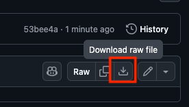
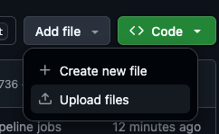
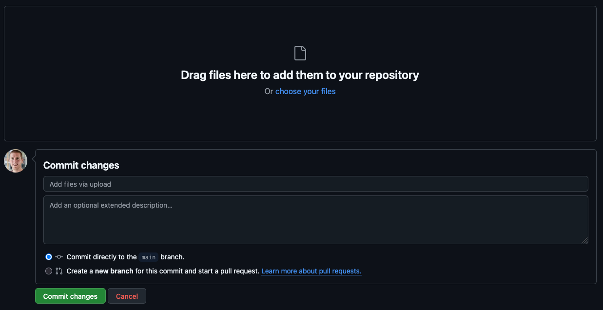
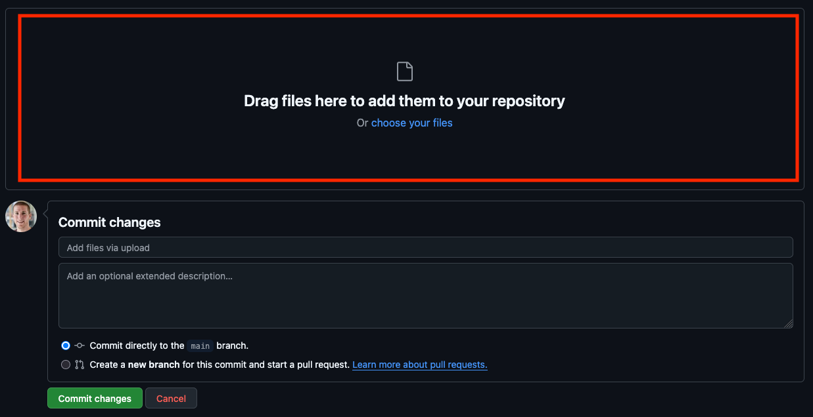
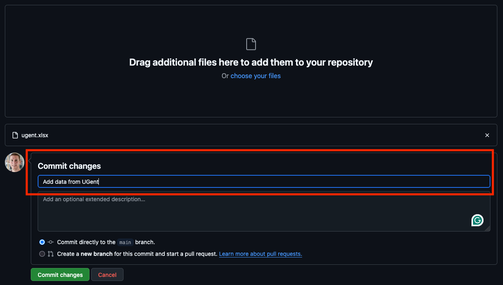
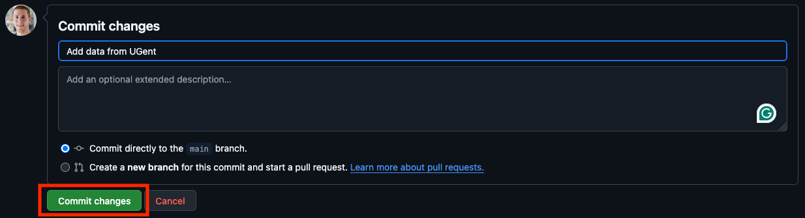

# Implementation process pipeline

This template repo helps with setting up a pipeline for an OSLO implementation process (implementatietraject).

- [Application profile]({{AP-URL}})
- [SHACL]({{SHACL-URL}})

## Usage

### Setting up this repository

You only have to do these steps once.

1. [Create a new repository based on this repository](https://docs.github.com/en/repositories/creating-and-managing-repositories/creating-a-repository-from-a-template).
2. Set the link to the application profile at `env.ap_url` in the file `.github/workflows/demo.yml`.
3. Set the link to the SHACL at `env.shacl_url` in the file `.github/workflows/demo.yml`.
4. Read and, if necessary, update [the license](LICENSE).
5. [Set up GitHub pages](https://docs.github.com/en/pages/getting-started-with-github-pages/creating-a-github-pages-site#creating-your-site)
   and let it point to the `docs` directory on the `main` branch.
6. Run the pipeline to make sure that everything works.
   This run will use the dummy data in the [data](./data) directory.
7. If everything works, empty the [data](./data) directory.
8. [Configure the dashboard](#configure-the-dashboard).

### Configure the dashboard

You can configure the dashboard via the following steps:

1. Create a copy of [this directory](https://github.com/RMLio/ap-data-to-dashboard/blob/main/miravi-initial-config/)
   in the root of the repo called `dashboard-config`.
2. Update the content of `dashboard-config`.
   You find the options of the dasboard in `dashboard-config/config.json`.
   See [this section](https://github.com/SolidLabResearch/miravi-a-linked-data-viewer?tab=readme-ov-file#configuration-file)
   for more information about the different options.
   You don't need to add the option `comunicaContext`,
   because pipeline sets this automatically.
   You store queries in `dashboard-config/public/queries`.

### Adding data via an Excel file

Note that adding data to this repository makes the data public
and the data will have [this license](LICENSE).

1. Download the Excel template called `template.xlsx` or an Excel file with example data:
    - Excel template:
        1. Browse to [the template in the repository](template.xlsx).
        2. Download the template by clicking on download icon (with the tooltip "Download raw file") on the right:

           
    - Excel file with example data:
        1. Navigate to the [example-data](./example-data) directory.
        2. Click on one of the Excel files.
        3. Download the Excel file by clicking on download icon (with the tooltip "Download raw file") on the right:

      
2. Rename the Excel file to something meaningful like the name of your organisation,
   for example, `ugent.xlsx` for Ghent University.
3. Fill in your data in the Excel file.
4. Upload the Excel to the repository.
    1. Click on "Add file":

       
    2. Click on "Upload files":

       
    3. You get a page where you can upload the Excel file:

       
    4. Upload the Excel file at the top

       
    5. Add a message describing your changes under the header "Commit changes":

       

       This can be, for example, "Add data from UGent".
    6. Click on the button "Commit changes":

       

### Updating data in an Excel file

Note that adding data to this repository makes the data public
and the data will have [this license](LICENSE).

1. Download the Excel file that you want to update:
    1. Browse to Excel file that you want to update.
    2. Download the template by clicking on download icon (with the tooltip "Download raw file") on the right:

       
2. Update the data in the Excel file.
3. Upload the Excel to the repository via the instructions in
   [step 4 of the section on how to add data via an Excel file](#adding-data-via-an-excel-file).

### Execute queries via the dashboard

1. Browse to the GitHub pages of this repository.
2. TODO: Add Miravi specific instructions

## Extras

- You can reset the README.md via

  ```shell
  ./scripts/reset-readme.sh
  ```

- Delete `shacl.ttl` to download the SHACL again.
